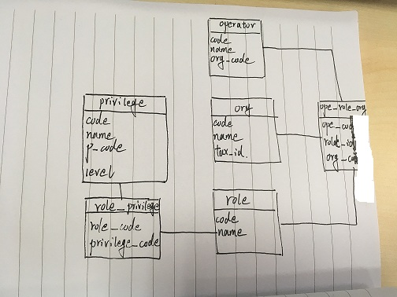

# 系统要点
---
### 权限
#### 主要表结构

思路是：

有组织机构表，岗位表，操作员表，权限表。

其中一个操作员和会分配多个岗位，一个岗位又可以分配多个机构，所以操作员_岗位_机构表中保存了三者的关系。

岗位的权限是由岗位_权限表保存的。

这样操作员拥有的权限可以通过分配的机构找到。

#### 功能权限
功能权限直接在前端通过判断是否包含对应的按钮权限，进行隐藏和显示。

#### 数据权限
数据权限通过后端的sql语句进行过滤，条件由前端传递到后端，由后端进行过滤。

### 进项
#### 进项采集
前端向客户端发起同步请求，使用了easyXDM解决跨域问题。
#### 进项认证
原理一样

#### 扫描仪数据接入
通过OCR的识别，录入系统。设计页面，将有误的数据放在最上面，并且加进度条提示。

### 销项
#### 待开数据导入
Excel导入工具：JXLS

邮件寄送：JavaMail 配置加代码
